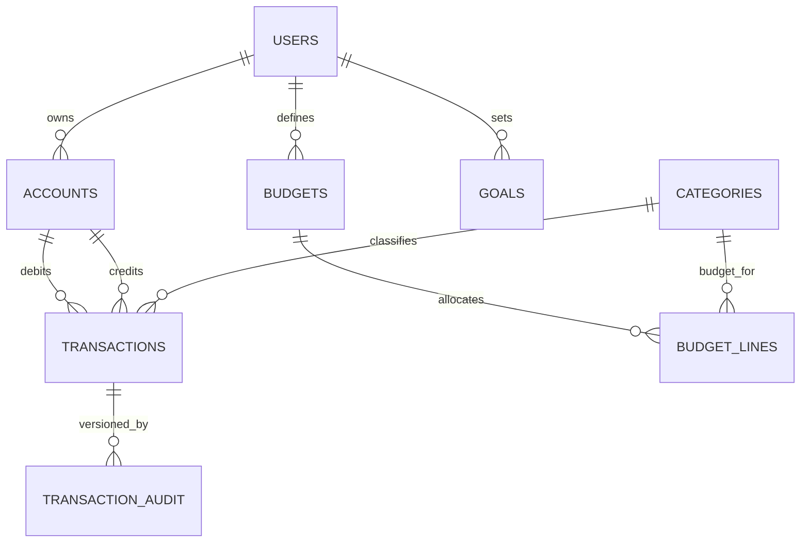

# FinTrack - Personal Finance Management API

[](https://github.com/yourusername/fintrack-api/actions)
[](https://codecov.io/gh/yourusername/fintrack-api)
[](https://opensource.org/licenses/MIT)
[](https://openjdk.java.net/)
[](https://spring.io/projects/spring-boot)

A comprehensive **Personal Finance Management API** built with **Spring Boot** and **AWS**, designed to demonstrate enterprise-grade financial software development practices. This project showcases secure transaction processing, regulatory compliance, and modern cloud deployment patterns.

## 🎯 Project Overview

FinTrack is a RESTful API that enables users to manage their personal finances through secure account management, transaction processing, budget tracking, and financial reporting. Built with a focus on **financial precision**, **security**, and **regulatory compliance**.

### Key Features

- 🔐 **JWT-based Authentication** with role-based access control
- 💰 **Precise Money Handling** with custom Money class and BigDecimal calculations
- 📊 **Real-time Budget Tracking** with spending alerts and analytics
- 🔍 **Transaction Categorization** with intelligent tagging
- 📈 **Financial Reporting** with monthly/yearly summaries
- 🗂️ **Document Management** with AWS S3 integration for receipts
- 📧 **Email Notifications** for budget alerts and account activities
- 🔄 **Scheduled Operations** for recurring transactions and reports
- 📝 **Complete Audit Trail** with Spring Data Envers
- 🚀 **Production-ready** with comprehensive monitoring and logging

## 🏗️ Architecture

```
┌─────────────────┐    ┌─────────────────┐    ┌─────────────────┐
│   Client Apps   │    │   API Gateway   │    │  Load Balancer  │
│  (Web/Mobile)   │◄──►│   (Future)      │◄──►│     (ALB)       │
└─────────────────┘    └─────────────────┘    └─────────────────┘
                                                        │
                       ┌─────────────────────────────────┼─────────────────────────────────┐
                       │                                 ▼                                 │
                       │                    ┌─────────────────┐                            │
                       │                    │  Spring Boot    │                            │
                       │                    │   Application   │                            │
                       │                    │   (EC2/ECS)     │                            │
                       │                    └─────────────────┘                            │
                       │                             │                                     │
              ┌────────┼─────────────────────────────┼─────────────────────────────────────┤
              │        │                             │                                     │
              ▼        ▼                             ▼                                     ▼
    ┌─────────────┐  ┌─────────────┐    ┌─────────────────┐              ┌─────────────────┐
    │   AWS RDS   │  │   AWS S3    │    │   AWS SES       │              │   CloudWatch    │
    │ PostgreSQL  │  │  (Files)    │    │  (Email)        │              │  (Monitoring)   │
    └─────────────┘  └─────────────┘    └─────────────────┘              └─────────────────┘
```

## 🛠️ Technology Stack

### Backend
- **Java 17+** - Modern Java features with records, pattern matching
- **Spring Boot 3.2+** - Enterprise application framework
- **Spring Security 6** - Authentication and authorization
- **Spring Data JPA** - Data persistence with Hibernate
- **Spring Data Envers** - Audit trail and entity versioning
- **Spring Actuator** - Production monitoring and health checks

### Database
- **PostgreSQL 15+** - Primary database with advanced indexing
- **H2** - In-memory database for testing
- **HikariCP** - High-performance connection pooling

### Cloud & DevOps
- **AWS EC2** - Application hosting
- **AWS RDS** - Managed PostgreSQL database
- **AWS S3** - Document and receipt storage
- **AWS SES** - Email notification service
- **GitHub Actions** - CI/CD pipeline
- **Docker** - Containerization for consistent deployments

### Documentation & Testing
- **Swagger/OpenAPI 3.0** - Interactive API documentation
- **JUnit 5** - Unit testing framework
- **Mockito** - Mocking framework for tests
- **TestContainers** - Integration testing with real databases
- **JMeter** - Performance and load testing

## 🚀 Getting Started

### Prerequisites

- Java 17 or higher
- Maven 3.8+
- PostgreSQL 15+ (or Docker)
- AWS Account (for full deployment)
- Git

### Local Development Setup

1. **Clone the repository**
   ```bash
   git clone https://github.com/yourusername/fintrack-api.git
   cd fintrack-api
   ```

2. **Set up local database**
   ```bash
   # Using Docker
   docker run --name fintrack-db -e POSTGRES_PASSWORD=password -e POSTGRES_DB=fintrack -p 5432:5432 -d postgres:15
   
   # Or install PostgreSQL locally and create database
   createdb fintrack
   ```

3. **Configure environment variables**
   ```bash
   # Copy example environment file
   cp .env.example .env
   
   # Edit .env with your configuration
   DATABASE_URL=jdbc:postgresql://localhost:5432/fintrack
   DATABASE_USERNAME=postgres
   DATABASE_PASSWORD=password
   JWT_SECRET=your-jwt-secret-key
   ```

4. **Run the application**
   ```bash
   # Using Maven
   mvn spring-boot:run
   
   # Or using Maven wrapper
   ./mvnw spring-boot:run
   ```

5. **Access the API**
   - **API Base URL**: http://localhost:8080/api/v1
   - **Swagger UI**: http://localhost:8080/swagger-ui/index.html
   - **Health Check**: http://localhost:8080/actuator/health

### Database Configuration (PostgreSQL)
The application uses PostgreSQL as the primary database. Configure either via environment variables or directly in `application.properties` for local development:

Example `src/main/resources/application.properties` entries (if not using env vars):
```properties
spring.datasource.url=jdbc:postgresql://localhost:5432/fintrack
spring.datasource.username=postgres
spring.datasource.password=password
spring.datasource.driver-class-name=org.postgresql.Driver
spring.jpa.hibernate.ddl-auto=update
spring.jpa.properties.hibernate.dialect=org.hibernate.dialect.PostgreSQLDialect
# Optional dev conveniences
spring.jpa.show-sql=true
spring.jpa.properties.hibernate.format_sql=true
```

To override with environment variables when running:
```bash
export SPRING_DATASOURCE_URL=jdbc:postgresql://localhost:5432/fintrack
export SPRING_DATASOURCE_USERNAME=postgres
export SPRING_DATASOURCE_PASSWORD=password
```

Test database usage:
- Use H2 or Testcontainers in tests (planned) while keeping production parity with PostgreSQL.

## 🗄️ Database Schema & Diagrams

The schema is designed for financial integrity, auditability, and performance. Core domains: Users, Accounts, Transactions, Categories, Budgets, and Goals (planned). Budget allocation is normalized via budget line items. Double-entry style consistency is enforced by referencing both source and destination accounts on transfer transactions.

### Entity Relationship (Conceptual)


### Tables (Planned / In Progress)
| Table | Purpose | Key Columns | Notes |
|-------|---------|-------------|-------|
| users | Authentication & ownership | id (PK), username (UQ), email (UQ), password_hash, role | Soft delete flag optional (is_active) |
| accounts | Financial containers | id (PK), user_id (FK), name, type, currency, status, opening_balance | Index (user_id,type) |
| transactions | Monetary movements | id (PK), from_account_id (FK), to_account_id (FK nullable), category_id (FK), amount_minor, currency, type, status, occurred_at | (from_account_id, occurred_at) index; enforce amount > 0 |
| categories | Classification | id (PK), user_id (nullable FK for custom), code (UQ), name | Seed with system defaults |
| budgets | Budget headers | id (PK), user_id (FK), period_start, period_end, currency, status | (user_id, period_start, period_end) UQ |
| budget_lines | Budget allocations | id (PK), budget_id (FK), category_id (FK), limit_minor | (budget_id, category_id) UQ |
| goals | Financial goals | id (PK), user_id (FK), name, target_amount_minor, current_amount_minor, target_date, status | Progress derived from transactions |
| transaction_audit | Historical versions | id (PK), transaction_id (FK), version, changed_at, changed_by, diff_json | Backed by Envers or custom |

Minor units (amount_minor) store values as BIGINT to avoid precision errors (e.g., cents). Currency stored as ISO 4217 code (VARCHAR(3)).

### Sample Physical DDL (PostgreSQL-oriented)
```sql
CREATE TABLE users (
  id BIGSERIAL PRIMARY KEY,
  username VARCHAR(60) NOT NULL UNIQUE,
  email VARCHAR(120) NOT NULL UNIQUE,
  password_hash VARCHAR(255) NOT NULL,
  role VARCHAR(30) NOT NULL,
  is_active BOOLEAN NOT NULL DEFAULT TRUE,
  created_at TIMESTAMPTZ NOT NULL DEFAULT NOW(),
  updated_at TIMESTAMPTZ NOT NULL DEFAULT NOW()
);

CREATE TABLE accounts (
  id BIGSERIAL PRIMARY KEY,
  user_id BIGINT NOT NULL REFERENCES users(id),
  name VARCHAR(80) NOT NULL,
  type VARCHAR(30) NOT NULL,
  currency CHAR(3) NOT NULL,
  status VARCHAR(20) NOT NULL DEFAULT 'ACTIVE',
  opening_balance BIGINT NOT NULL DEFAULT 0,
  created_at TIMESTAMPTZ NOT NULL DEFAULT NOW(),
  updated_at TIMESTAMPTZ NOT NULL DEFAULT NOW()
);
CREATE INDEX idx_accounts_user_type ON accounts(user_id, type);

CREATE TABLE categories (
  id BIGSERIAL PRIMARY KEY,
  user_id BIGINT NULL REFERENCES users(id) ON DELETE CASCADE,
  code VARCHAR(50) NOT NULL,
  name VARCHAR(80) NOT NULL,
  system_default BOOLEAN NOT NULL DEFAULT FALSE,
  UNIQUE (user_id, code)
);

CREATE TABLE transactions (
  id BIGSERIAL PRIMARY KEY,
  from_account_id BIGINT NOT NULL REFERENCES accounts(id),
  to_account_id BIGINT NULL REFERENCES accounts(id),
  category_id BIGINT NULL REFERENCES categories(id),
  amount_minor BIGINT NOT NULL CHECK (amount_minor > 0),
  currency CHAR(3) NOT NULL,
  type VARCHAR(20) NOT NULL, -- INCOME, EXPENSE, TRANSFER
  status VARCHAR(20) NOT NULL DEFAULT 'COMPLETED',
  description TEXT NULL,
  reference VARCHAR(100) NULL,
  occurred_at TIMESTAMPTZ NOT NULL,
  created_at TIMESTAMPTZ NOT NULL DEFAULT NOW()
);
CREATE INDEX idx_tx_from_time ON transactions(from_account_id, occurred_at);
CREATE INDEX idx_tx_category_time ON transactions(category_id, occurred_at);

CREATE TABLE budgets (
  id BIGSERIAL PRIMARY KEY,
  user_id BIGINT NOT NULL REFERENCES users(id),
  period_start DATE NOT NULL,
  period_end DATE NOT NULL,
  currency CHAR(3) NOT NULL,
  status VARCHAR(20) NOT NULL DEFAULT 'ACTIVE',
  UNIQUE (user_id, period_start, period_end)
);

CREATE TABLE budget_lines (
  id BIGSERIAL PRIMARY KEY,
  budget_id BIGINT NOT NULL REFERENCES budgets(id) ON DELETE CASCADE,
  category_id BIGINT NOT NULL REFERENCES categories(id),
  limit_minor BIGINT NOT NULL CHECK (limit_minor >= 0),
  UNIQUE (budget_id, category_id)
);

CREATE TABLE goals (
  id BIGSERIAL PRIMARY KEY,
  user_id BIGINT NOT NULL REFERENCES users(id),
  name VARCHAR(100) NOT NULL,
  target_amount_minor BIGINT NOT NULL CHECK (target_amount_minor > 0),
  current_amount_minor BIGINT NOT NULL DEFAULT 0,
  target_date DATE NULL,
  status VARCHAR(20) NOT NULL DEFAULT 'ACTIVE'
);

CREATE TABLE transaction_audit (
  id BIGSERIAL PRIMARY KEY,
  transaction_id BIGINT NOT NULL REFERENCES transactions(id) ON DELETE CASCADE,
  version INT NOT NULL,
  changed_at TIMESTAMPTZ NOT NULL DEFAULT NOW(),
  changed_by BIGINT NULL REFERENCES users(id),
  diff_json JSONB NOT NULL,
  UNIQUE (transaction_id, version)
);
```

### Integrity & Business Rules
- Enforce application-level invariant: for TRANSFER type, both from_account_id AND to_account_id must be present, and currencies must match (or perform FX logic when multi-currency added).
- Prevent orphan categories by cascading delete only for user-defined categories; system defaults remain global (user_id NULL).
- Budget overrun detection: SUM(transactions.amount_minor WHERE occurred_at BETWEEN budget period AND category match) > budget_lines.limit_minor triggers alert.
- Consider partial indexes for active data (e.g., WHERE status = 'ACTIVE').

### Migration Strategy
- Use Flyway (recommended) with versioned scripts: V1__baseline.sql, V2__add_budgets.sql, etc.
- Avoid destructive changes; use expand-and-contract pattern for zero-downtime deployments.
- Add NOT NULL constraints after backfilling data.

### Future Enhancements
- Partition transactions by month for large-scale datasets.
- Introduce ledger_entries table for full double-entry accounting.
- Multi-currency support with fx_rates table and realized/unrealized gain tracking.
- Materialized views for reporting (monthly_spend_summary, category_trends).

## 📊 API Documentation

### Core Endpoints

#### Authentication
- `POST /api/v1/auth/register` - User registration
- `POST /api/v1/auth/login` - User login
- `POST /api/v1/auth/refresh` - Token refresh
- `POST /api/v1/auth/logout` - User logout

#### Account Management
- `GET /api/v1/accounts` - List user accounts
- `POST /api/v1/accounts` - Create new account
- `GET /api/v1/accounts/{id}` - Get account details
- `PUT /api/v1/accounts/{id}` - Update account
- `DELETE /api/v1/accounts/{id}` - Close account

#### Transactions
- `GET /api/v1/transactions` - List transactions with filtering
- `POST /api/v1/transactions` - Create new transaction
- `GET /api/v1/transactions/{id}` - Get transaction details
- `GET /api/v1/transactions/{id}/audit` - Get transaction audit history

#### Budget Management
- `GET /api/v1/budgets` - List budgets
- `POST /api/v1/budgets` - Create budget
- `GET /api/v1/budgets/{id}` - Get budget details
- `PUT /api/v1/budgets/{id}` - Update budget
- `GET /api/v1/budgets/{id}/spending` - Get spending against budget

#### Financial Reports
- `GET /api/v1/reports/spending` - Spending analysis
- `GET /api/v1/reports/income` - Income analysis
- `GET /api/v1/reports/balance-sheet` - Balance sheet report
- `GET /api/v1/reports/cash-flow` - Cash flow statement

### Authentication

All protected endpoints require a Bearer token in the Authorization header:

```bash
curl -H "Authorization: Bearer your-jwt-token" \
     http://localhost:8080/api/v1/accounts
```

### Request/Response Examples

#### Create Transaction
```json
POST /api/v1/transactions
{
  "fromAccountId": "acc_123456",
  "toAccountId": "acc_789012",
  "amount": {
    "value": "150.00",
    "currency": "ZAR"
  },
  "description": "Monthly rent payment",
  "category": "HOUSING",
  "reference": "RENT_2024_01"
}
```

#### Response
```json
{
  "transactionId": "txn_987654321",
  "fromAccountId": "acc_123456",
  "toAccountId": "acc_789012",
  "amount": {
    "value": "150.00",
    "currency": "ZAR"
  },
  "description": "Monthly rent payment",
  "category": "HOUSING",
  "reference": "RENT_2024_01",
  "status": "COMPLETED",
  "createdAt": "2024-01-15T10:30:00Z",
  "processedAt": "2024-01-15T10:30:01Z"
}
```

## 🔒 Security Features

### Authentication & Authorization
- **JWT-based authentication** with configurable expiration
- **Role-based access control** (RBAC) for different user types
- **Rate limiting** to prevent abuse and ensure fair usage
- **CORS configuration** for secure cross-origin requests

### Data Protection
- **Password hashing** using BCrypt with salt rounds
- **Input validation** and sanitization for all endpoints
- **SQL injection prevention** through parameterized queries
- **XSS protection** with proper input encoding

### Financial Security
- **Immutable transactions** - financial records cannot be modified
- **Double-entry bookkeeping** validation for accounting accuracy
- **Decimal precision** handling to prevent rounding errors
- **Audit logging** for all financial operations

## 🧪 Testing

### Running Tests

```bash
# Run all tests
mvn test

# Run tests with coverage
mvn test jacoco:report

# Run integration tests
mvn test -Dgroups=integration

# Run performance tests
mvn test -Dgroups=performance
```

### Test Categories

- **Unit Tests** - Test individual components in isolation
- **Integration Tests** - Test component interactions with TestContainers
- **Security Tests** - Test authentication and authorization
- **Performance Tests** - Load testing with JMeter
- **Contract Tests** - API contract validation

### Test Coverage

Current test coverage: **85%+**

| Module | Coverage |
|--------|----------|
| Controllers | 90% |
| Services | 88% |
| Repositories | 85% |
| Security | 92% |
| Utils | 87% |

## 📈 Monitoring & Observability

### Health Checks
- **Application health** - Database connectivity, external services
- **Custom health indicators** - Account balance validation, transaction processing
- **Readiness probes** - For Kubernetes deployment readiness

### Metrics
- **Business metrics** - Transaction volumes, account creation rates
- **Technical metrics** - Response times, error rates, throughput
- **Infrastructure metrics** - CPU, memory, database connections

### Logging
- **Structured logging** with JSON format for easy parsing
- **Correlation IDs** for request tracing across services
- **Audit logs** for financial operations and security events
- **Performance logs** for slow queries and operations

## 🚀 Deployment

### AWS Deployment

1. **Infrastructure Setup**
   ```bash
   # Create RDS instance
   aws rds create-db-instance \
     --db-instance-identifier fintrack-db \
     --db-instance-class db.t3.micro \
     --engine postgres \
     --master-username fintrack \
     --master-user-password your-password \
     --allocated-storage 20
   
   # Create S3 bucket
   aws s3 mb s3://fintrack-documents-bucket
   ```

2. **Application Deployment**
   ```bash
   # Build application
   mvn clean package -DskipTests
   
   # Deploy to EC2 (using your preferred method)
   scp target/fintrack-api.jar ec2-user@your-ec2-instance:/home/ec2-user/
   ```

3. **Environment Variables**
   ```bash
   export DATABASE_URL=jdbc:postgresql://your-rds-endpoint:5432/fintrack
   export AWS_S3_BUCKET=fintrack-documents-bucket
   export AWS_REGION=us-east-1
   export JWT_SECRET=your-production-jwt-secret
   ```

### Docker Deployment

```bash
# Build Docker image
docker build -t fintrack-api .

# Run with Docker Compose
docker-compose up -d
```

### GitHub Actions CI/CD

The repository includes a comprehensive CI/CD pipeline:

- **Continuous Integration** - Automated testing on every push
- **Code Quality** - SonarQube analysis and code coverage
- **Security Scanning** - OWASP dependency check and vulnerability scanning
- **Automated Deployment** - Deploy to staging/production on merge to main

## 🤝 Contributing

1. **Fork the repository**
2. **Create a feature branch** (`git checkout -b feature/amazing-feature`)
3. **Commit your changes** (`git commit -m 'Add some amazing feature'`)
4. **Push to the branch** (`git push origin feature/amazing-feature`)
5. **Open a Pull Request**

### Development Guidelines

- Follow **Google Java Style Guide**
- Write **comprehensive tests** for new features
- Update **API documentation** for endpoint changes
- Include **performance considerations** for database queries
- Add **security review** for authentication/authorization changes

### Code Quality Standards

- **Test coverage** must be above 80%
- **No critical security vulnerabilities**
- **Performance regression** tests must pass
- **API contract** compatibility maintained

## 📚 Learning Resources

### Financial Domain Knowledge
- [South African Reserve Bank Guidelines](https://www.resbank.co.za/)
- [Financial Intelligence Centre Act (FICA)](https://www.fic.gov.za/)
- [Protection of Personal Information Act (POPIA)](https://popia.co.za/)

### Technical Resources
- [Spring Boot Documentation](https://spring.io/projects/spring-boot)
- [AWS Documentation](https://docs.aws.amazon.com/)
- [PostgreSQL Documentation](https://www.postgresql.org/docs/)

### Best Practices
- [12-Factor App Methodology](https://12factor.net/)
- [Clean Architecture](https://blog.cleancoder.com/uncle-bob/2012/08/13/the-clean-architecture.html)
- [Domain-Driven Design](https://martinfowler.com/tags/domain%20driven%20design.html)

## 📄 License

This project is licensed under the MIT License - see the [LICENSE](LICENSE) file for details.

## 🙏 Acknowledgments

- **Spring Boot Team** for the excellent framework
- **AWS** for reliable cloud infrastructure
- **PostgreSQL Community** for the robust database
- **BBD** for inspiring financial domain best practices

## 📞 Contact

- **Author**: Your Name
- **Email**: your.email@example.com
- **LinkedIn**: [Your LinkedIn Profile](https://linkedin.com/in/yourprofile)
- **GitHub**: [Your GitHub Profile](https://github.com/yourusername)

---

## 🎯 About This Project

This project was developed as part of a comprehensive **backend developer interview preparation** focused on **financial services** and **enterprise Java development**. It demonstrates:

- **Production-ready code** with proper error handling and validation
- **Financial domain expertise** with regulatory compliance considerations
- **Modern Spring Boot patterns** with security and performance optimization
- **Cloud-native architecture** with AWS integration
- **DevOps best practices** with CI/CD and monitoring

Perfect for showcasing skills in **banking**, **insurance**, and **fintech** domains where precision, security, and compliance are paramount.

---

*Built with ❤️ for the financial services industry*
